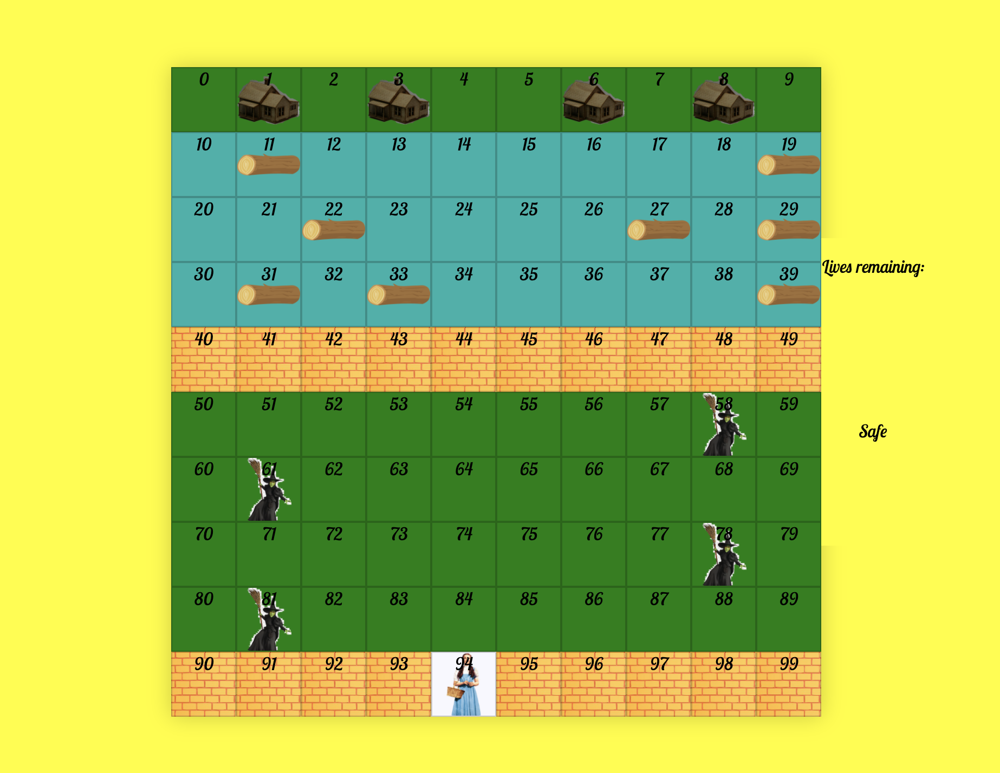
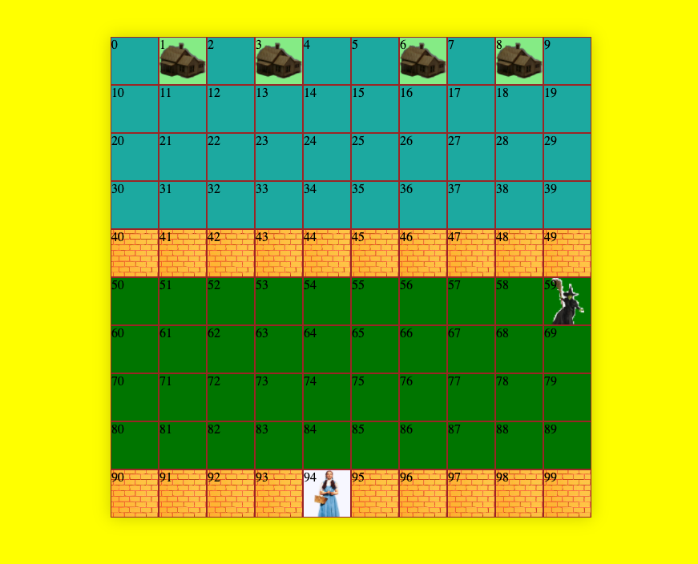
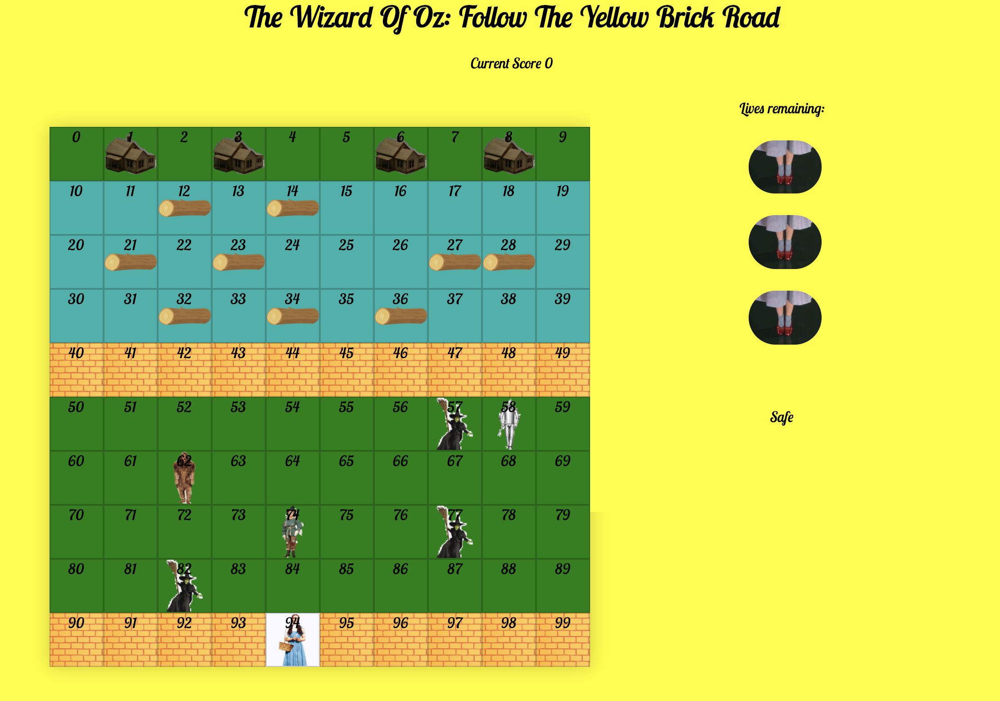

#  Project #1: Follow The Yellow Brick Road
# Brief

Design a grid-based game using HTML, CSS, and JavaScript learnt in the first three weeks of the course. The game should be playable for one player and the player must be able to win and lose. Timeframe: 1 week. 

# Deployment

Please follow th elink to play my game: https://hugokinahan.github.io/sei-project-1/

# Motivation

This project was my first ever JavaScript project, so replicating a relatively staright-forward classic arcade game like 'frogger' would be a good place to start. I chose The Wizard Of Oz as a theme as I believe it reflected a similar story line to that of 'frogger' with Dorothy trying to make it home akin to the frog attempting to make it back to its lilypad. 

With Dorothy under threat from the Wicked Witch of the West, the aim of the game is to make it across the Wicked Witch's forest and cross the river to bring Dorothy home. 'There's no place like home...'. Along the way you can pick up trusty companions, the Scarecrow, Tinman and the Lion to help build your score. 

# Process

The first stages included implementing the grid on the page and enabling keyboard movement for Dorothy. This was a realtively simple switch statement. 

```
switch (event.keyCode) {
      case 39: //arrow right
      case 68: //d key
        if (horizontalPosition < width - 1) dorothyPosition++
        getBonusPoints()
        hitWitch()
        
        checkWaterDanger()
        checkHomeAreaDanger()
        break
      case 37: //arrow left
      case 65: //a key
        if (horizontalPosition > 0) dorothyPosition--
        getBonusPoints()
        hitWitch()
        
        checkWaterDanger()
        checkHomeAreaDanger()
        break
      case 38: //arrow up
      case 87: //w key
        if (verticalPosition > 0) dorothyPosition -= width
        getDorothyHome()
        getBonusPoints()
        hitWitch()
      
        checkWaterDanger()
        checkHomeAreaDanger()
        break
      case 40: //arrow down
      case 83: //s key
        if (verticalPosition < width - 1) dorothyPosition += width
        getBonusPoints()
        hitWitch()
        checkWaterDanger()
        checkHomeAreaDanger()
        break
      default:
        console.log('INVALID KEY')
    }
```

After this was tested successfully, I moved onto creating the moving Witches and Logs. This challenging aspect took time but once I was happy with the finished result I could then implement 'check' functions to see if Dorothy had hit any of the obstacles that would make her lose a life. You can see in the code above that I was able to use my 'check' functions on each key movement. You can see an example of a check function below.

```
  function checkWaterDanger() {
    if (waterArea.includes(cells[dorothyPosition] ) ) {
      if (logs.map(item => item.position).includes(dorothyPosition)) {
        console.log('I have arrived on a Log and I am happy and safe')
      } else {
        console.log('I should be dead')
        waterSound.play()
        return loseLife()
      }
    }
  }
```

MVP took four days to reach, and after I was happy with the functionality of the game I decided to move on to scoring and adding some bonus features. Most notably the player is able to collect an extra 50 bonus points by collecting other characters mentioned above. These reset everytime Dorothy accomplishes her mission of reaching the other side. I also added a timer and a scoreboard to put some pressure on the player and to make the game a little more difficult. The very last thing to add was some audio to boost the overall experience of the game.

# Screenshots

MVP 



Grid



Scoring Added



Completed Game


# Frameworks used

- Languages
- JavaScript, CSS3, HTML5
- Typefaces
- Google Fonts
- Text Editor
- VS Code
- Browser
- Chrome
- Version control
- Git and GitHub

# Challenges

There were many challenging parts to my project. I had trouble with the movement of Witches and Logs as obstacles, especially in getting them to move continuosly accross the screen without stopping when they reached the side of the grid. I did manage to accomplish this, but in quite a long-winded fashion and in hindsight using an Class Object would have made things easier. 

However, the most challenging aspect of my project was formulating the logic for when Dorothy is safe on a log in the river, meaning she should not die when on a log and in the waterArea (the blue area on the grid). As I already had code implemented instructing that when Dorothy is in the waterArea she should lose a life. 

To get around this I put the log positions into an Array Object and used the checkWaterDanger function to instruct that when the waterArea array .includes Dorothy on a log she is safe and if she is not on a log but is in the waterArea, the player should lose a life.

```const logClass = 'log'
const logPositionOne = {
  position: 15
}
const logPositionTwo = {
  position: 17
}
const logPositionThree = {
  position: 29
}
const logPositionFour = {
  position: 27
}
const logPositionFive = {
  position: 25
}
const logPositionSix = {
  position: 23
}
const logPositionSeven = {
  position: 31
}
const logPositionEight = {
  position: 33
}
const logPositionNine = {
  position: 35
}
const logs = [logPositionOne, logPositionTwo, logPositionThree, logPositionFour, logPositionFive, logPositionSix, logPositionSeven, logPositionEight, logPositionNine]
```
```  function checkWaterDanger() {
if (waterArea.includes(cells[dorothyPosition] ) ) {
  if (logs.map(item => item.position).includes(dorothyPosition)) {
    console.log('I have arrived on a Log and I am happy and safe')
  } else {
    console.log('I should be dead')
    waterSound.play()
    return loseLife()
  }
}
}
```

# Wins

There were many aspects of the game that I was proud of including the construction of the grid and the implementation of audio throughout the game. However, the area I am most pleased with is the hitWitch function. 

The hitWitch function was used to detect whether the player had collided with any of the twelve witches within the forestArea of the grid. If a collision was detected then the player would lose one of their three lives. If all three were lost the player would lose the game. I then applied this function to each of the keyUp listeners on each key code of the up, down, left and right button. 

```  // ! HIT WITCH 

function hitWitch() {
  if (cells[dorothyPosition] === cells[witchPositionOne]) {
    return loseLife()
  } if (cells[dorothyPosition] === cells[witchPositionTwo]) {
    return loseLife() 
  } if (cells[dorothyPosition] === cells[witchPositionThree]) {
    return loseLife() 
  } if (cells[dorothyPosition] === cells[witchPositionFour]) {
    return loseLife() 
  } if (cells[dorothyPosition] === cells[witchPositionFive]) {
    return loseLife()
  } if (cells[dorothyPosition] === cells[witchPositionSix]) {
    return loseLife()
  } if (cells[dorothyPosition] === cells[witchPositionSeven]) {
    return loseLife() 
  } if (cells[dorothyPosition] === cells[witchPositionEight]) {
    return loseLife()
  } if (cells[dorothyPosition] === cells[witchPositionNine]) {
    return loseLife()
  } if (cells[dorothyPosition] === cells[witchPositionTen]) {
    return loseLife()
  } if (cells[dorothyPosition] === cells[witchPositionEleven]) {
    return loseLife()
  } if (cells[dorothyPosition] === cells[witchPositionTwelve]) {
    return loseLife()
  }
}
```

```
// * Move Dorothy
function handleKeyUp(event) {
  removeDorothy(dorothyPosition)
  scoreDisplay.innerHTML = score += 10

  const horizontalPosition = dorothyPosition % width
  const verticalPosition = Math.floor(dorothyPosition / width)

  switch (event.keyCode) {
    case 39: //arrow right
    case 68: //d key
      if (horizontalPosition < width - 1) dorothyPosition++
      getBonusPoints()
      hitWitch()
      
      checkWaterDanger()
      checkHomeAreaDanger()
      break
    case 37: //arrow left
    case 65: //a key
      if (horizontalPosition > 0) dorothyPosition--
      getBonusPoints()
      hitWitch()
      
      checkWaterDanger()
      checkHomeAreaDanger()
      break
    case 38: //arrow up
    case 87: //w key
      if (verticalPosition > 0) dorothyPosition -= width
      getDorothyHome()
      getBonusPoints()
      hitWitch()
    
      checkWaterDanger()
      checkHomeAreaDanger()
      break
    case 40: //arrow down
    case 83: //s key
      if (verticalPosition < width - 1) dorothyPosition += width
      getBonusPoints()
      hitWitch()
      checkWaterDanger()
      checkHomeAreaDanger()
      break
    default:
      console.log('INVALID KEY')
  }

  addDorothy(dorothyPosition)
}
```
# Key Learnings

This was my first project after just three weeks of HTML, CSS and JavaScript. I pleased with my finished application however, I learnt some valuable lessons. 

I definitely rushed to get started with code. In hindsight I would spend a lot longer planning each stage of my build. I lacked a direction in what I was going to do next and often bumped into errors I could have avoided with a clear plan.

# Future Features

If I had more time with my project there would be a number of features that I would have liked to have the opportunity to add:

- Create different difficulty levels 
- Add a high score board using localStorage
- Created a two player mode on the same computer, where players take turns
- I would have liked to create a smoother and more seamless movement for my obstacles through CSS animation 
- Make it mobile friendly 
- I would have had a deeper look at refactoring my code 
